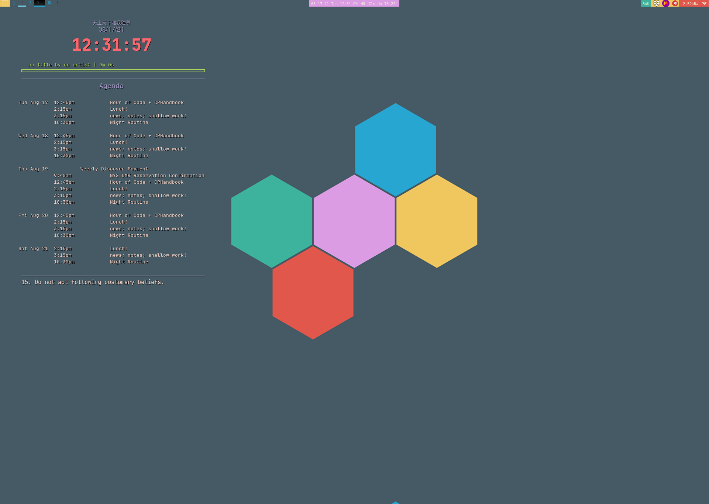

# Backup and Dotfiles
Backup files using [rsync](https://wiki.archlinux.org/title/rsync).

----

## Highlights
- [vimrc](./dotfiles/.vimrc)
- [zshrc](./dotfiles/.zshrc)
- [productive qtile config](./dotfiles/qtile/productive_config.py)   
 
    
<!--      -->

- [normal qtile config](./dotfiles/qtile/fun_config.py)
- [xinitrc](./dotfiles/.xinitrc)
- Dmenu scripts for notetaking, opening apps, opening files, and managing tasks

---

## ToDo

- [x] fix screenshots for configs in readme
- [x] update qtile config keys

